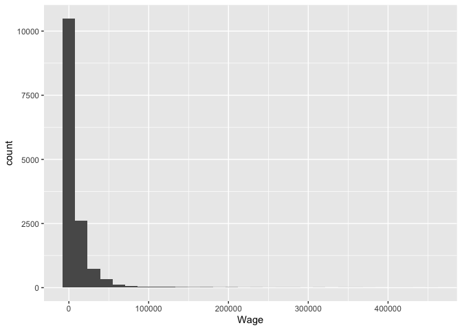
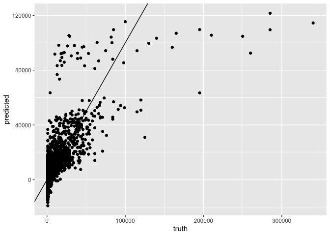
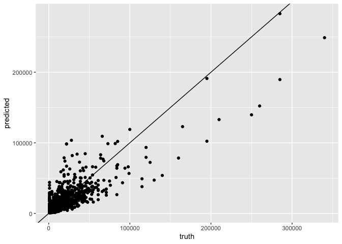
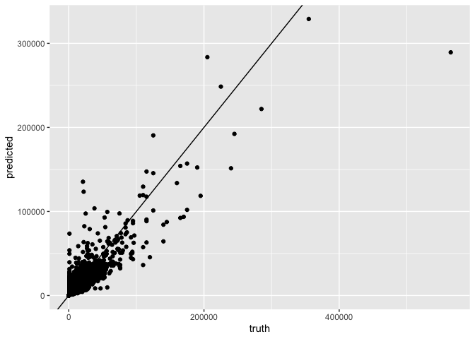

Soccer players wage prediciton
================
Iyar Lin
12 September, 2019

  - [Intro](#intro)
  - [Dataset exploration and feature
    engineering](#dataset-exploration-and-feature-engineering)
  - [Missing value imputation](#missing-value-imputation)
  - [Try different models](#try-different-models)
      - [Regression](#regression)
      - [Random forest](#random-forest)
  - [Final submission](#final-submission)
  - [Actual performance on test set](#actual-performance-on-test-set)

# Intro

In this task I’ll utilize the [FIFA 2019 player
attributes](https://www.kaggle.com/karangadiya/fifa19) kaggle dataset to
predict player wage.

# Dataset exploration and feature engineering

``` r
train <- read.csv("data/train_data.csv")
test <- read.csv("data/test_data.csv")
```

Let’s look at the target variable distribution:

``` r
train %>% ggplot(aes(Wage)) + geom_histogram()
```

<!-- -->

There’s a large proportion (0.0133883) of values that are equal to 0.

We can see that all 0 wages are associated with missing club value:

``` r
train %>%
  mutate(Wage_0 = Wage == 0) %>%
  group_by(is.na(Club)) %>%
  summarise(Wage_0_freq = mean(Wage_0)) %>%
  pandoc.table()
```

| is.na(Club) | Wage\_0\_freq |
| :---------: | :-----------: |
|    FALSE    |       0       |
|    TRUE     |       1       |

We can thus “predict” in cases where the club is missing that the wage
will be 0. I’ll thus remove these cases from the training set.

``` r
train <- train %>%
  filter(Wage != 0) %>%
  select(-Club)
```

After running str(train) we do the following obviuos transformations to
the data:

``` r
train <- train %>%
  select(-c(X, ID, Name, Photo, Flag, Club.Logo, Joined, Contract.Valid.Until)) %>% # could use joined and Contract.Valid.Until to calculate contract length but given time limitation will drop this
  mutate(
    Value = as.numeric(gsub("EURO|M", "", Value)),
    Jersey.Number = Jersey.Number > 1 & Jersey.Number <= 11, # best players are in the first 11
    Height = as.numeric(gsub(".+'", "", Height)) + as.numeric(gsub("'.+", "", Height)) * 12, # convert to inches
    Weight = as.numeric(gsub("lbs", "", Weight)),
    Release.Clause = as.numeric(gsub("EURO|M", "", Value))
  )
```

Looking at the “Load From” column below we see there’s very sparse
distribution of clubs loaned from:

``` r
train %>%
  group_by(Loaned.From) %>%
  summarise(count = n()) %>%
  group_by(no_of_players_loaned_from_same_club = count) %>%
  summarise(count = n()) %>%
  pandoc.table()
```

| no\_of\_players\_loaned\_from\_same\_club | count |
| :---------------------------------------: | :---: |
|                     1                     |  112  |
|                     2                     |  58   |
|                     3                     |  46   |
|                     4                     |  34   |
|                     5                     |  16   |
|                     6                     |  16   |
|                     7                     |  10   |
|                     8                     |   8   |
|                     9                     |   6   |
|                    10                     |   4   |
|                    11                     |   3   |
|                    12                     |   2   |
|                    14                     |   1   |
|                    16                     |   2   |
|                   13361                   |   1   |

I’ll thus remove it

``` r
train$Loaned.From <- NULL
```

There’s a largre number of variables such as “LM”, “RF” etc containing
strings of the form: xy + z.

Let’s explore xy, and z for LM:

``` r
LM <- train %>% mutate(xy = gsub("\\+.+", "", LM), z = gsub(".+\\+", "", LM))
LM %>%
  group_by(z) %>%
  summarise(count = n()) %>%
  arrange(-count) %>%
  head(10) %>% 
  pandoc.table(caption = "Feature: LM - z")
```

| z  | count |
| :-: | :---: |
| 2  | 12459 |
| NA | 1644  |
| 3  |  265  |
| 4  |   1   |
| 5  |   1   |

Feature: LM - z

Next, the xy portion:

``` r
LM %>%
  group_by(xy) %>%
  summarise(count = n()) %>%
  arrange(-count) %>%
  head(10) %>%
  pandoc.table(caption = "Feature: LM - xy")
```

| xy | count |
| :-: | :---: |
| NA | 1644  |
| 61 |  650  |
| 62 |  602  |
| 63 |  598  |
| 64 |  583  |
| 65 |  576  |
| 60 |  571  |
| 59 |  549  |
| 66 |  546  |
| 67 |  485  |

Feature: LM - xy

Let’s look at another such feature:

``` r
LDM <- train %>% mutate(xy = gsub("\\+.+", "", LDM), z = gsub(".+\\+", "", LDM))
LDM %>%
  group_by(z) %>%
  summarise(count = n()) %>%
  arrange(-count) %>%
  pandoc.table(caption = "Feature: LDM - z")
```

| z  | count |
| :-: | :---: |
| 2  | 12459 |
| NA | 1644  |
| 3  |  265  |
| 4  |   1   |
| 5  |   1   |

Feature: LDM - z

``` r
LDM %>%
  group_by(xy) %>%
  summarise(count = n()) %>%
  arrange(-count) %>%
  head(10) %>%
  pandoc.table(caption = "Feature: LDM - xy")
```

| xy | count |
| :-: | :---: |
| NA | 1644  |
| 60 |  518  |
| 62 |  517  |
| 61 |  505  |
| 64 |  473  |
| 59 |  463  |
| 63 |  463  |
| 58 |  460  |
| 57 |  424  |
| 54 |  420  |

Feature: LDM - xy

We can see that the “z” part is not very informative. We’ll just clip
the xy part:

``` r
train <- bind_cols(train %>%
  mutate_at(vars(LS:RB), list(~ as.numeric(gsub("\\+.+", "", .)))), 
  train %>% select(LS:RB) %>% mutate_all(~factor(gsub(".+\\+", "", .))))
```

From the str(train) we can see that some of the factors have huge number
of levels. We’ll merge together all factor levels which account for less
than 5% of observations.

``` r
merge_small_factor_levels <- function(factor_vec, thresh = 0.01) {
  factor_vec <- as.character(factor_vec)
  factor_vec_levels <- table(factor_vec)
  small_levels <- factor_vec_levels[factor_vec_levels < length(factor_vec) * thresh]
  factor_vec[factor_vec %in% names(small_levels)] <- ".merged"
  factor_vec <- factor(factor_vec)
  return(factor_vec)
}

train <- train %>% mutate_if(is.factor, list(~ merge_small_factor_levels(.)))
```

# Missing value imputation

Let’s look at how many values are missing in the remaining variables:

``` r
missing <- train %>%
  summarise_all(list(~ round(mean(is.na(.)), 3))) %>%
  gather(variable, missing) %>%
  arrange(-missing) %>%
  pandoc.table()
```

|         variable         | missing |
| :----------------------: | :-----: |
|          Value           |  0.62   |
|      Release.Clause      |  0.62   |
|            LS            |  0.114  |
|            ST            |  0.114  |
|            RS            |  0.114  |
|            LW            |  0.114  |
|            LF            |  0.114  |
|            CF            |  0.114  |
|            RF            |  0.114  |
|            RW            |  0.114  |
|           LAM            |  0.114  |
|           CAM            |  0.114  |
|           RAM            |  0.114  |
|            LM            |  0.114  |
|           LCM            |  0.114  |
|            CM            |  0.114  |
|           RCM            |  0.114  |
|            RM            |  0.114  |
|           LWB            |  0.114  |
|           LDM            |  0.114  |
|           CDM            |  0.114  |
|           RDM            |  0.114  |
|           RWB            |  0.114  |
|            LB            |  0.114  |
|           LCB            |  0.114  |
|            CB            |  0.114  |
|           RCB            |  0.114  |
|            RB            |  0.114  |
|           LS1            |  0.114  |
|           ST1            |  0.114  |
|           RS1            |  0.114  |
|           LW1            |  0.114  |
|           LF1            |  0.114  |
|           CF1            |  0.114  |
|           RF1            |  0.114  |
|           RW1            |  0.114  |
|           LAM1           |  0.114  |
|           CAM1           |  0.114  |
|           RAM1           |  0.114  |
|           LM1            |  0.114  |
|           LCM1           |  0.114  |
|           CM1            |  0.114  |
|           RCM1           |  0.114  |
|           RM1            |  0.114  |
|           LWB1           |  0.114  |
|           LDM1           |  0.114  |
|           CDM1           |  0.114  |
|           RDM1           |  0.114  |
|           RWB1           |  0.114  |
|           LB1            |  0.114  |
|           LCB1           |  0.114  |
|           CB1            |  0.114  |
|           RCB1           |  0.114  |
|           RB1            |  0.114  |
|      Preferred.Foot      |  0.003  |
| International.Reputation |  0.003  |
|        Weak.Foot         |  0.003  |
|       Skill.Moves        |  0.003  |
|        Work.Rate         |  0.003  |
|        Body.Type         |  0.003  |
|        Real.Face         |  0.003  |
|         Position         |  0.003  |
|      Jersey.Number       |  0.003  |
|          Height          |  0.003  |
|          Weight          |  0.003  |
|         Crossing         |  0.003  |
|        Finishing         |  0.003  |
|     HeadingAccuracy      |  0.003  |
|       ShortPassing       |  0.003  |
|         Volleys          |  0.003  |
|        Dribbling         |  0.003  |
|          Curve           |  0.003  |
|        FKAccuracy        |  0.003  |
|       LongPassing        |  0.003  |
|       BallControl        |  0.003  |
|       Acceleration       |  0.003  |
|       SprintSpeed        |  0.003  |
|         Agility          |  0.003  |
|        Reactions         |  0.003  |
|         Balance          |  0.003  |
|        ShotPower         |  0.003  |
|         Jumping          |  0.003  |
|         Stamina          |  0.003  |
|         Strength         |  0.003  |
|        LongShots         |  0.003  |
|        Aggression        |  0.003  |
|      Interceptions       |  0.003  |
|       Positioning        |  0.003  |
|          Vision          |  0.003  |
|        Penalties         |  0.003  |
|        Composure         |  0.003  |
|         Marking          |  0.003  |
|      StandingTackle      |  0.003  |
|      SlidingTackle       |  0.003  |
|         GKDiving         |  0.003  |
|        GKHandling        |  0.003  |
|        GKKicking         |  0.003  |
|      GKPositioning       |  0.003  |
|        GKReflexes        |  0.003  |
|           Age            |    0    |
|       Nationality        |    0    |
|         Overall          |    0    |
|        Potential         |    0    |
|           Wage           |    0    |
|         Special          |    0    |

For all features other than Value and Release.Clause I’ll just use mean
and mode imputation.

We can see that Value and Release.Clause are missing about 60% of the
time. We’ll generate 2 datasets to which we’ll build predictive models:

1.  All columns except Value and Release.Clause  
2.  All columns and all rows that have non missing values of Value and
    Release.Clause

On the same occasion I’ll also generate a test set to benchmark against
the different models.

``` r
impute_mode <- function(factor_vec) {
  factor_vec <- as.character(factor_vec)
  most_common_level <- names(sort(table(factor_vec), decreasing = T))[1]
  factor_vec[is.na(factor_vec)] <- most_common_level
  factor_vec <- factor(factor_vec)
  return(factor_vec)
}

train <- train %>%
  mutate_if(function(x) is.factor(x) | is.logical(x), list(~ impute_mode(.))) %>%
  mutate_at(which(sapply(., function(x) is.numeric(x) | is.integer(x)) & !names(.) %in% c("Value", "Release.Clause")), list(~ replace(., is.na(.), mean(., na.rm = T))))

train_ind <- sample.int(nrow(train), nrow(train) * 0.8)
train_1 <- train %>%
  slice(train_ind) %>%
  select(-c(Value, Release.Clause))
train_2 <- train %>%
  slice(train_ind) %>%
  filter(!is.na(Value) & !is.na(Release.Clause))
small_test <- train %>% slice(-train_ind)
```

For ease of use I’ll check different models just looking at the first
train set, and will apply the winning model to the second train set.

# Try different models

## Regression

``` r
RMSE <- function(y, y_hat) sqrt(mean((y - y_hat)^2))
lm_model <- lm(Wage ~ ., data = train_1)
test_pred <- predict(lm_model, newdata = small_test)

lm_rmse <- RMSE(small_test$Wage, test_pred)

data.frame(truth = small_test$Wage, predicted = test_pred) %>% ggplot(aes(truth, predicted)) + geom_point() + geom_abline(slope = 1, intercept = 0)
```

<!-- -->

## Random forest

``` r
rf_model <- ranger(Wage ~ ., data = train_1)
test_pred <- predict(rf_model, data = small_test)$predictions

rf_rmse <- RMSE(small_test$Wage, test_pred)
data.frame(truth = small_test$Wage, predicted = test_pred) %>% ggplot(aes(truth, predicted)) + geom_point() + geom_abline(slope = 1, intercept = 0)
```

<!-- -->

Here’s the resulting RMSE for both models:

``` r
data.frame(model = c("linear regression", "random forest"), RMSE = c(lm_rmse, rf_rmse)) %>% pandoc.table()
```

|       model       | RMSE  |
| :---------------: | :---: |
| linear regression | 13272 |
|   random forest   | 9684  |

# Final submission

we’ll use the random forest model.

``` r
mode <- function(factor_vec) {
  factor_vec <- as.character(factor_vec)
  most_common_level <- names(sort(table(factor_vec), decreasing = T))[1]
  return(most_common_level)
}

factor_modes <- train %>%
  select_if(function(x) is.factor(x) | is.logical(x)) %>%
  summarise_all(list(~ mode(.))) %>%
  gather(variable, value)

numeric_means <- train %>%
  select(-c(Value, Release.Clause, Wage)) %>%
  select_if(function(x) is.numeric(x) | is.logical(x)) %>%
  summarise_all(mean, na.rm = T) %>%
  gather(variable, value)

test <- test %>%
  mutate(
    Value = as.numeric(gsub("EURO|M", "", Value)),
    Jersey.Number = Jersey.Number > 1 & Jersey.Number <= 11, # best players are in the first 11
    Height = as.numeric(gsub(".+'", "", Height)) + as.numeric(gsub("'.+", "", Height)) * 12, # convert to inches
    Weight = as.numeric(gsub("lbs", "", Weight)),
    Release.Clause = as.numeric(gsub("EURO|M", "", Value))
  )

test <- bind_cols(test %>% mutate_at(vars(LS:RB), list(~ as.numeric(gsub("\\+.+", "", .)))), 
                  test %>% select(LS:RB) %>% mutate_all(~factor(gsub(".+\\+", "", .))))
  
for (var in numeric_means$variable) {
  variable <- test[[var]]
  variable[is.na(variable)] <- numeric_means$value[numeric_means$variable == var]
  test[[var]] <- variable
}

for (var in factor_modes$variable) {
  variable <- test[[var]]
  variable <- as.character(variable)
  variable[is.na(variable)] <- factor_modes$value[factor_modes$variable == var]
  variable <- factor(variable, levels = levels(train[[var]]))
  variable[is.na(variable)] <- ".merged"
  test[[var]] <- variable
}

train_1 <- train %>% select(-c(Value, Release.Clause))
train_2 <- train %>% filter(!is.na(Value) & !is.na(Release.Clause))

model_1 <- ranger(Wage ~ ., data = train_1)
model_2 <- ranger(Wage ~ ., data = train_2)

test_pred <- rep(NA, nrow(test))
test_pred[is.na(test$Club)] <- 0

pred_1 <- predict(model_1, data = test %>% filter((is.na(Value) | is.na(Release.Clause)) & !is.na(Club)))$predictions
pred_2 <- predict(model_2, data = test %>% filter((!is.na(Value) & !is.na(Release.Clause)) & !is.na(Club)))$predictions
test_pred[(is.na(test$Value) | is.na(test$Release.Clause)) & !is.na(test$Club)] <- pred_1
test_pred[(!is.na(test$Value) & !is.na(test$Release.Clause)) & !is.na(test$Club)] <- pred_2
```

# Actual performance on test set

``` r
test_Wage <- read.csv("data/test_Wage.csv")[, 1]
rmse_true <- RMSE(test_Wage, test_pred)

data.frame(truth = test_Wage, predicted = test_pred) %>% ggplot(aes(truth, predicted)) + geom_point() + geom_abline(slope = 1, intercept = 0)
```

<!-- -->

The performance on the test is:

``` r
data.frame(metric = c("RMSE", "R^2"), value = c(rmse_true, 1 - var(test_Wage - test_pred) / var(test_Wage))) %>% pandoc.table(caption = "Performance on test set")
```

| metric | value  |
| :----: | :----: |
|  RMSE  | 10182  |
|  R^2   | 0.7845 |

Performance on test set
